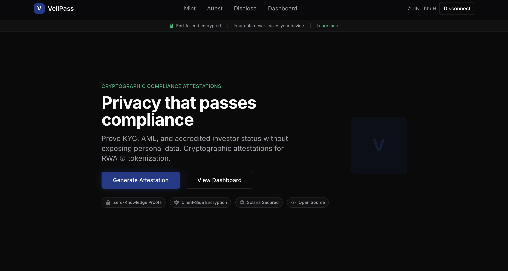
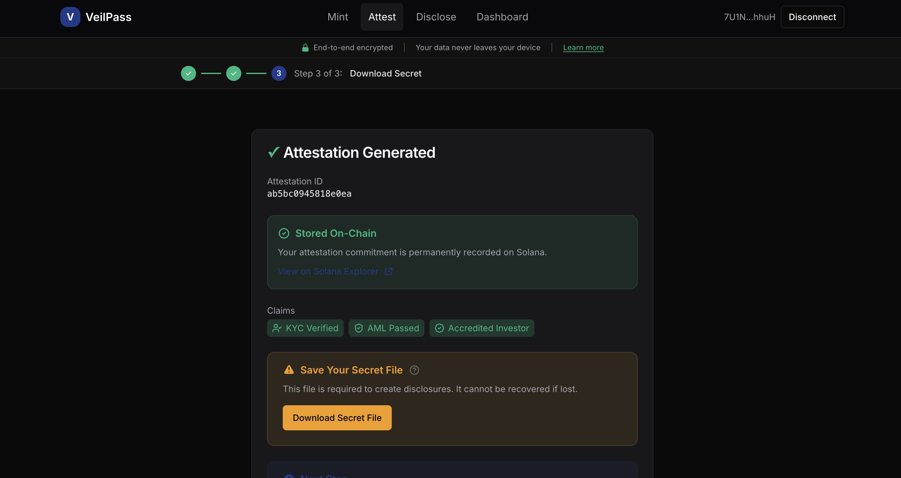
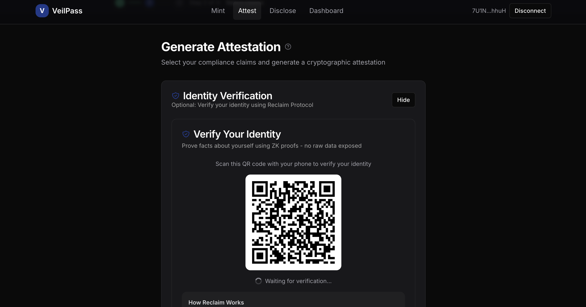
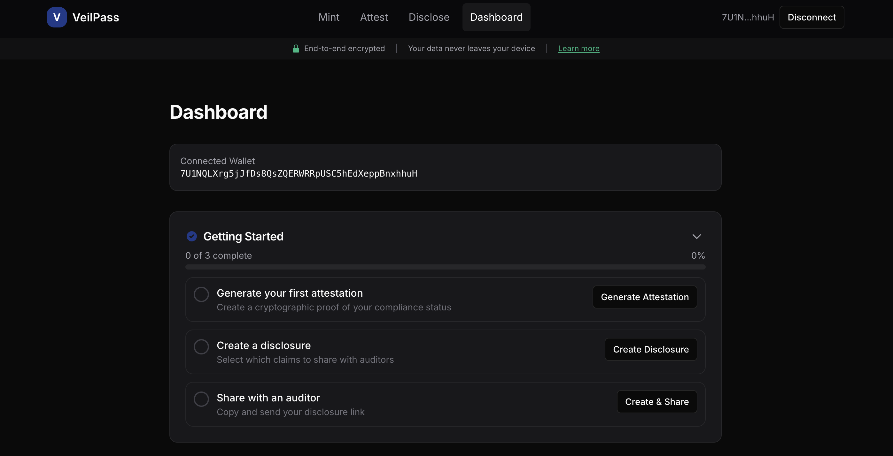

# VeilPass

**Privacy-preserving compliance attestations for tokenized real-world assets on Solana**

VeilPass enables users to prove compliance (KYC, AML, accredited investor status) without revealing personal information. Using cryptographic attestations, on-chain verification, and selective disclosure, auditors can verify compliance while your data stays private.

🌐 **Live Demo**: [veilpass-nu.vercel.app](https://veilpass-nu.vercel.app)



---

## Features

### 🔐 Privacy-First Compliance
- Generate cryptographic attestations for compliance claims
- Selective disclosure - share only what's needed
- Zero personal data exposed to verifiers

### ⛓️ On-Chain Verification (Solana)
- Attestation commitments stored on Solana via Memo Program
- Verifiable on [Solana Explorer](https://explorer.solana.com/?cluster=devnet)
- Immutable proof of attestation existence




### 🛡️ Real-Time Risk Screening (Range API)
- Wallet risk assessment powered by [Range Security](https://range.org)
- Sanctions and AML screening
- Risk scores from 0-10 with detailed factors

### 🪪 Identity Verification (Reclaim Protocol)
- Zero-knowledge identity proofs via [Reclaim Protocol](https://reclaimprotocol.org)
- Verify GitHub, Google, LinkedIn accounts
- No raw data shared - only verified claims



### 💰 Private Transfers (Privacy Cash)
- SDK integrated for shielded SOL transfers
- Break on-chain link between sender and receiver
- *Note: Infrastructure on mainnet only*

---

## How It Works

```
┌─────────────────┐     ┌──────────────────┐     ┌─────────────────┐
│  1. GENERATE    │────▶│  2. STORE        │────▶│  3. DISCLOSE    │
│  Attestation    │     │  On-Chain        │     │  Selectively    │
│  (Claims + Sig) │     │  (Solana Memo)   │     │  (Time-Limited) │
└─────────────────┘     └──────────────────┘     └─────────────────┘
                                                          │
                                                          ▼
                                                 ┌─────────────────┐
                                                 │  4. VERIFY      │
                                                 │  Cryptographic  │
                                                 │  (No PII)       │
                                                 └─────────────────┘
```

1. **Generate Attestation** - Connect wallet, select claims, sign with wallet
2. **On-Chain Storage** - Commitment hash stored on Solana (verifiable on Explorer)
3. **Create Disclosure** - Choose claims to share, set expiration
4. **Verify** - Auditors verify cryptographically without seeing personal data



---

## Tech Stack

| Layer | Technology |
|-------|------------|
| **Frontend** | Next.js 14, TypeScript, Tailwind CSS |
| **Wallet** | Solana Wallet Adapter (Phantom, Backpack) |
| **Blockchain** | Solana Devnet (via Helius RPC) |
| **Compliance** | Range API (real-time risk scoring) |
| **Identity** | Reclaim Protocol (ZK identity proofs) |
| **Privacy** | Privacy Cash SDK (shielded transfers) |
| **Storage** | Vercel KV (attestation metadata) |

---

## Local Development

### Prerequisites

- Node.js 24+ (required for Privacy Cash WASM)
- npm or yarn

### Setup

```bash
# Clone the repository
git clone https://github.com/yourusername/veilpass.git
cd veilpass

# Install dependencies
npm install

# Create environment file
cp .env.example .env.local

# Generate encryption secret
echo "ENCRYPTION_SECRET=$(openssl rand -hex 32)" >> .env.local

# Start development server
npm run dev
```

Open [http://localhost:3000](http://localhost:3000)

### Environment Variables

```env
# Required
ENCRYPTION_SECRET=           # 64-char hex string
NEXT_PUBLIC_APP_URL=         # Your app URL

# Solana (Required for on-chain features)
HELIUS_RPC_URL=              # Helius RPC endpoint
SOLANA_PAYER_SECRET=         # JSON array of keypair bytes
NEXT_PUBLIC_SOLANA_NETWORK=  # devnet or mainnet-beta

# Range API (Required for compliance screening)
RANGE_API_KEY=               # From https://app.range.org
RANGE_API_URL=               # https://api.range.org

# Reclaim Protocol (Required for identity verification)
RECLAIM_APP_ID=              # From https://dev.reclaimprotocol.org
RECLAIM_APP_SECRET=          # App secret
RECLAIM_PROVIDER_ID=         # Provider ID (e.g., GitHub)

# Optional
KV_REST_API_URL=             # Vercel KV URL
KV_REST_API_TOKEN=           # Vercel KV token
```

---

## Testing the Integrations

### 1. On-Chain Storage
```bash
# Generate an attestation via the UI, then check Solana Explorer
# The attestation page shows "View on Solana Explorer" link
```

### 2. Range API Compliance
```bash
curl -X POST http://localhost:3000/api/compliance/check \
  -H "Content-Type: application/json" \
  -d '{"address":"YOUR_WALLET_ADDRESS"}'
```

### 3. Reclaim Identity Verification
```bash
# Navigate to /attest and click "Verify Identity"
# Scan QR code with phone to complete verification
```

### 4. Privacy Cash
```bash
# Check pool info
curl http://localhost:3000/api/privacy-cash/info

# Note: Deposits/withdrawals require mainnet
```

---

## API Endpoints

| Endpoint | Method | Description |
|----------|--------|-------------|
| `/api/attestations/generate` | POST | Generate new attestation |
| `/api/attestations/store-onchain` | POST | Store commitment on Solana |
| `/api/compliance/check` | POST | Check wallet risk score |
| `/api/reclaim/session` | POST | Create identity verification session |
| `/api/reclaim/verify` | POST | Verify identity proof |
| `/api/privacy-cash/info` | GET | Get Privacy Cash pool info |
| `/api/privacy-cash/balance` | GET | Get private balance |
| `/api/disclosures/create` | POST | Create selective disclosure |
| `/api/disclosures/[id]` | GET | Get disclosure details |

---

## Compliance Claims

- ✅ KYC Verified
- ✅ AML Passed
- ✅ Accredited Investor
- ✅ Jurisdiction Compliant
- ✅ Source of Funds Verified

---

## Bounty Integrations

| Integration | Bounty | Status |
|-------------|--------|--------|
| **Privacy Cash** | $6,000 | ✅ SDK Integrated (mainnet-ready) |
| **Range API** | $1,500 | ✅ Live (real risk scores) |
| **Reclaim Protocol** | - | ✅ Live (real ZK sessions) |

---

## Project Structure

```
src/
├── app/
│   ├── api/
│   │   ├── attestations/     # Attestation generation & on-chain storage
│   │   ├── compliance/       # Range API integration
│   │   ├── reclaim/          # Reclaim Protocol integration
│   │   ├── privacy-cash/     # Privacy Cash SDK endpoints
│   │   └── disclosures/      # Selective disclosure
│   ├── attest/               # Attestation page
│   ├── dashboard/            # User dashboard
│   ├── disclose/             # Create disclosure
│   └── verify/[id]/          # Verification page
├── components/
│   ├── PrivacyCashPanel.tsx  # Privacy Cash UI
│   ├── ReclaimVerification.tsx # Identity verification UI
│   └── ui/                   # Shared UI components
├── hooks/
│   ├── useCompliance.ts      # Compliance check hook
│   └── usePrivacyCash.ts     # Privacy Cash hook
└── lib/
    ├── solana-memo.ts        # On-chain memo storage
    ├── range-api.ts          # Range API client
    ├── reclaim-server.ts     # Reclaim Protocol server
    └── privacy-cash-server.ts # Privacy Cash server wrapper
```

---

## Security

- All attestation secrets are encrypted at rest
- No personal data stored on-chain (only commitment hashes)
- Selective disclosure with time-limited access
- Wallet signature required for attestation generation

---

## License

MIT

---

## Links

- [Live Demo](https://veilpass-nu.vercel.app)
- [Solana Explorer (Devnet)](https://explorer.solana.com/?cluster=devnet)
- [Range Security](https://range.org)
- [Reclaim Protocol](https://reclaimprotocol.org)
- [Privacy Cash](https://privacycash.io)
